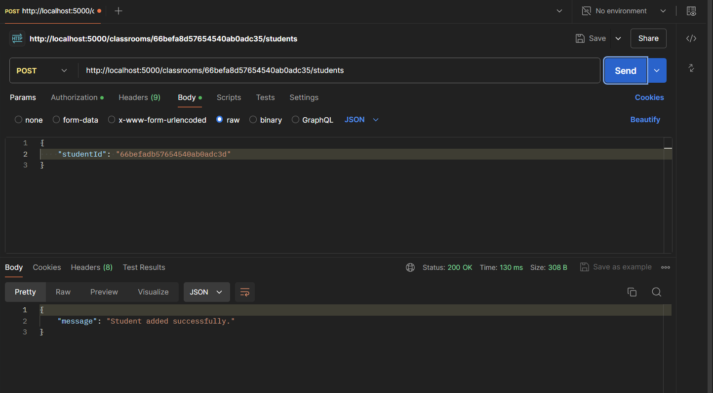

# Installation

1. Clone the repository
2. Run `npm install`
3. Run `nodemon index.js`

## Environment Variables

- `PORT`
- `MONGODB_URI`
- `JWT_SECRET`

## Authentication

- JWT based authentication with token for students and teachers
- The student or teacher can register first name, email and password and then login with the email and password to get a token
- The token is required to access the API endpoints

# Deployment Link

- [Deployed Backend](https://shipmnts-task-1-kl7rep95g-utsavs-projects-43359c4e.vercel.app/)

# API Endpoints

## Teacher Routes

- **POST** `/teachers/register`: Register a new teacher
- **POST** `/teachers/login`: Login for teachers
- **POST** `/teachers/:teacherId/classrooms`: Create a new classroom
- **GET** `/teachers/:teacherId/classrooms`: View all classrooms for a teacher

## Student Routes

- **POST** `/students/register`: Register a new student
- **POST** `/students/login`: Login for students
- **GET** `/students/:studentId/classrooms`: View classrooms for a student
- **POST** `/students/:studentId/classrooms/:classroomId/tasks/:taskId`: Submit a task

## Classroom Routes

- **DELETE** `/classrooms/:classroomId`: Delete a classroom
- **PUT** `/classrooms/:classroomId`: Edit a classroom
- **POST** `/classrooms/:classroomId/students`: Add a student to a classroom
- **DELETE** `/classrooms/:classroomId/students/:studentId`: Remove a student from a classroom
- **POST** `/classrooms/:classroomId/tasks`: Assign tasks to a classroom
- **GET** `/classrooms/:classroomId/tasks/:taskId/submissions`: Check submission status for a task

# Screenshots

## Register Teacher

## Login Teacher

## Create Classroom

## View Classrooms

## Register Student

## Login Student

## View Classrooms for Student

## Add a student to classroom

## Assign tasks to classroom

